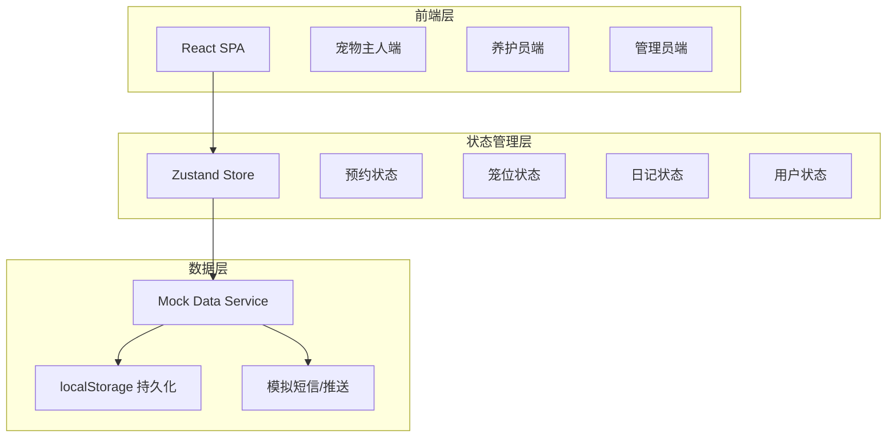
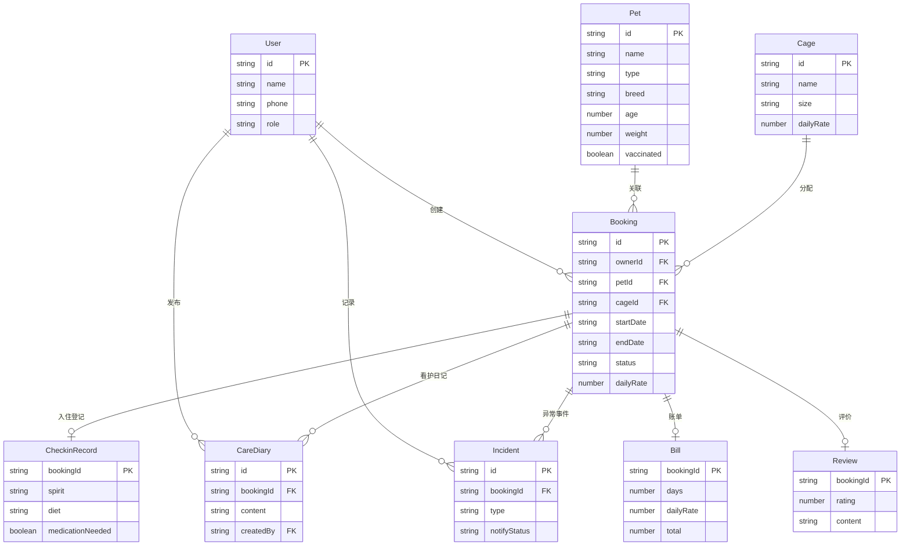

## 1. 架构设计



## 2. 技术说明

- **前端**：React@18 + TypeScript + Tailwind CSS@3 + Vite
- **初始化工具**：Vite (react-ts template)
- **路由**：React Router@6
- **状态管理**：Zustand（轻量、TypeScript友好）
- **图表库**：Recharts（管理面板数据可视化）
- **日期处理**：date-fns
- **图标**：Lucide React
- **动画**：Framer Motion
- **后端**：无（纯前端，使用Mock数据 + localStorage持久化）
- **数据持久化**：localStorage + Zustand persist middleware

## 3. 路由定义

| 路由 | 用途 | 权限 |
|------|------|------|
| `/login` | 登录注册页 | 公开 |
| `/` | 机构首页 | 公开 |
| `/booking` | 预约寄养页 | 主人 |
| `/my-bookings` | 我的预约页 | 主人 |
| `/my-bookings/:id` | 预约详情页 | 主人 |
| `/staff` | 养护工作台 | 养护员 |
| `/staff/checkin/:id` | 入住登记页 | 养护员 |
| `/staff/diary/:bookingId` | 看护日记页 | 养护员 |
| `/staff/incident/:bookingId` | 异常记录页 | 养护员 |
| `/staff/checkout/:id` | 离店结算页 | 养护员 |
| `/admin` | 管理面板页 | 管理员 |
| `/admin/reports` | 报表查询页 | 管理员 |

## 4. API定义（Mock Service）

### 4.1 核心类型定义

```typescript
type UserRole = "owner" | "caretaker" | "admin"

type BookingStatus = "pending" | "confirmed" | "checked_in" | "checked_out" | "cancelled"

type IncidentType = "vomiting" | "refusing_food" | "injury" | "other"

type PetSpirit = "energetic" | "calm" | "lethargic" | "anxious"

type PetDiet = "normal" | "reduced" | "refusing"

interface User {
  id: string
  name: string
  phone: string
  role: UserRole
  avatar?: string
}

interface Pet {
  id: string
  name: string
  type: "dog" | "cat" | "other"
  breed: string
  age: number
  weight: number
  specialNeeds?: string
  vaccinated: boolean
}

interface Cage {
  id: string
  name: string
  size: "small" | "medium" | "large"
  dailyRate: number
}

interface Booking {
  id: string
  ownerId: string
  petId: string
  cageId: string
  startDate: string
  endDate: string
  actualEndDate?: string
  status: BookingStatus
  createdAt: string
  checkinRecord?: CheckinRecord
  dailyRate: number
  bill?: Bill
  review?: Review
}

interface CheckinRecord {
  bookingId: string
  spirit: PetSpirit
  diet: PetDiet
  medicationNeeded: boolean
  medicationDetail?: string
  photos: string[]
  checkedInAt: string
  checkedInBy: string
}

interface CareDiary {
  id: string
  bookingId: string
  content: string
  images: string[]
  createdAt: string
  createdBy: string
}

interface Incident {
  id: string
  bookingId: string
  type: IncidentType
  description: string
  photos: string[]
  createdAt: string
  createdBy: string
  notifyStatus: "sent" | "viewed" | "reminded" | "escalated"
  viewedAt?: string
}

interface Bill {
  bookingId: string
  days: number
  dailyRate: number
  subtotal: number
  extras: { name: string; amount: number }[]
  total: number
  generatedAt: string
}

interface Review {
  bookingId: string
  rating: number
  content: string
  createdAt: string
}
```

### 4.2 Mock服务接口

| 方法 | 描述 |
|------|------|
| `getAvailableCages(start, end)` | 查询指定日期范围内空余笼位 |
| `getAlternativeDates(start, end)` | 获取3个最近可用替代日期 |
| `createBooking(data)` | 创建预约并锁定笼位 |
| `getBookingsByOwner(ownerId)` | 获取主人名下所有预约 |
| `checkInBooking(bookingId, record)` | 核销预约并登记入住信息 |
| `addCareDiary(bookingId, diary)` | 添加看护日记（每日上限2条） |
| `addIncident(bookingId, incident)` | 记录异常事件并推送通知 |
| `checkOutBooking(bookingId)` | 离店结算，生成账单 |
| `submitReview(bookingId, review)` | 提交评价（72h内有效） |
| `getDashboardStats()` | 获取管理面板统计数据 |
| `getReports(filters)` | 按条件查询历史记录 |
| `getReviews()` | 获取公开评价列表 |

## 5. 数据模型

### 5.1 数据模型定义



### 5.2 Mock初始数据

系统预置以下Mock数据用于演示：

- 3个管理员/养护员/主人账号
- 15个笼位（小5/中5/大5），日费率分别为80/120/180
- 10只宠物信息
- 20条历史预约（含各种状态）
- 50条看护日记
- 8条异常事件记录
- 15条评价数据
